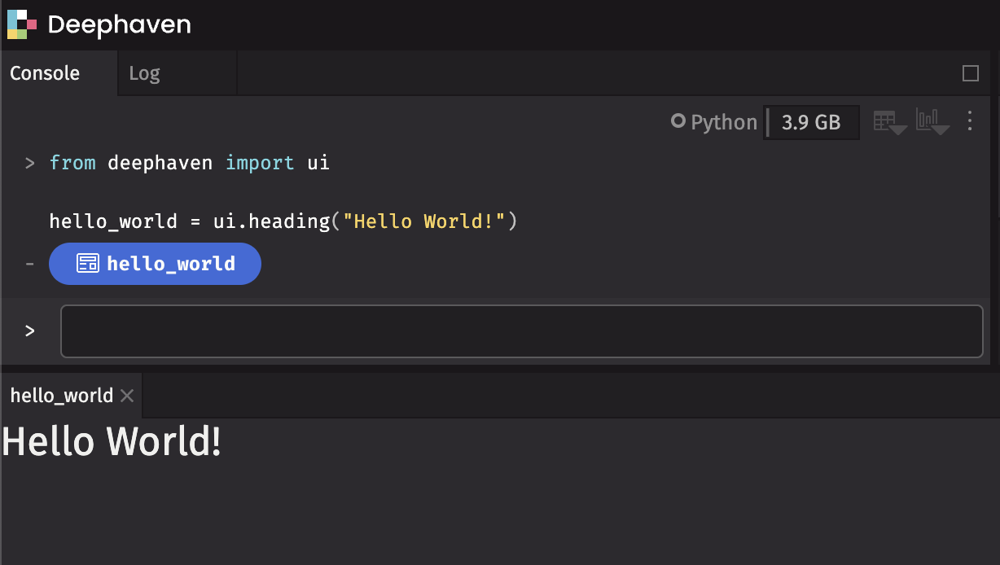
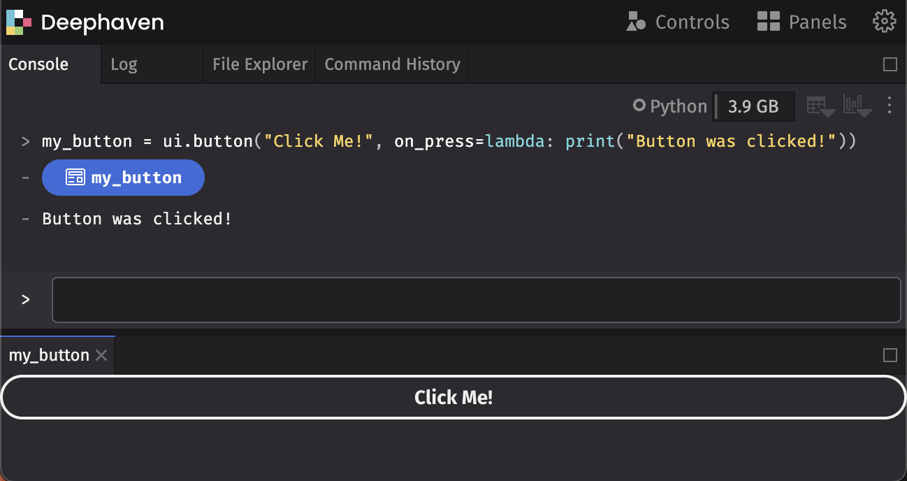
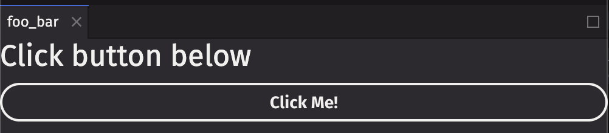
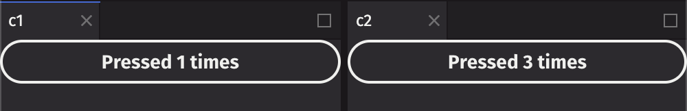
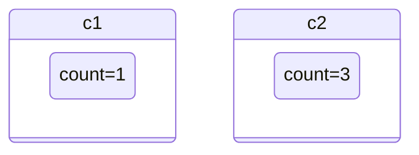
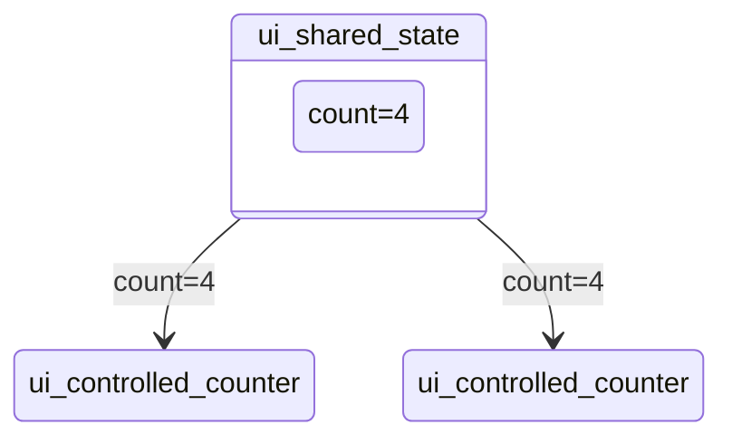

# Introduction

deephaven.ui is a plugin for Deephaven that allows for programmatic layouts and callbacks. It uses a React-like approach to building components and rendering them in the UI, allowing for creating reactive components that can be re-used and composed together, as well as reacting to user input from the UI.

Below are some examples to demonstrate some of the functionality you can do so far with deephaven.ui. At this point it is only showcasing the subset of the planned functionality that has been implemented, but should give an idea of what is possible. Most notably, all examples will only appear within one panel in the UI, the `ui.table` functionality (allowing interactivity and customization of displayed tables), and ability to use other plugins (such as deephaven.plot.express) is not yet implemented.

You can run the example Docker container with the following command:

```
docker run --rm --name deephaven-ui -p 10000:10000 --pull=always ghcr.io/deephaven/server-ui:edge
```

You'll need to find the link to open the UI in the Docker logs:


# Using components

Get started by importing the `deephaven.ui` package as `ui`:

```python
from deephaven import ui
```

The `ui` package contains many _components_, which you can display in the UI:

```python
hello_world = ui.heading("Hello World!")
```



By assigning the component to the `hello_world` variable, it displays in the UI in a panel named `hello_world`.

## Handling events

Write functions to handle events. To write a button that will print event details to the console when clicked:

```python
my_button = ui.button("Click Me!", on_press=lambda e: print(f"Button was clicked! {e}"))
```



## Creating components

Use the `@ui.component` decorator to create your own custom components. This decorator wraps the function provided as a Deephaven component. For more details on the architecture, see [TODO: Link to architecture]().

We can display a heading above a button as our custom component:

```python
@ui.component
def ui_foo_bar():
    return [
        ui.heading("Click button below"),
        ui.button("Click Me!", on_press=lambda: print("Button was clicked!")),
    ]


foo_bar = ui_foo_bar()
```



## Using state

Often, you'll want to react to the button presses and update the display. For example, to count the number of times a button has been pressed, use [`ui.use_state`]() to introduce a _state variable_ in your custom component:

```python
@ui.component
def ui_counter():
    count, set_count = ui.use_state(0)
    # ...
```

Returned from `ui.use_state` is a tuple with two values: the current state (`count`), and a function to update that state (`set_count`).

The first time the button is displayed, the count will be `0` because that is the initial value passed into `ui.use_state`. Call `set_count` to update the state:

```python
@ui.component
def ui_counter():
    count, set_count = ui.use_state(0)
    return ui.button(f"Pressed {count} times", on_press=lambda: set_count(count + 1))
```

When state is updated, deephaven.ui will call your component again to re-render with the new value. After clicking once, it will re-render with `count` set to `1`, then set to `2`, and so on.

Each individual component has its own state:

```python
@ui.component
def ui_counter():
    count, set_count = ui.use_state(0)
    return ui.button(f"Pressed {count} times", on_press=lambda: set_count(count + 1))


c1 = ui_counter()
c2 = ui_counter()
```



> [!NOTE]
> Functions are prefixed with `use_` are called _hooks_. `use_state` is built-in to deephaven.ui, and there are other hooks built-in shown below. You can also create your own hooks.
> Hooks are special functions. They must only be used at the _top_ of a `@ui.component` or another hook. If you want to use one in a conditional or a loop, extract that logic to a new component and put it there.

## Sharing state

In the previous example, the two buttons incremented their counter independently. State was stored within the counter components:



What if we wanted to have two buttons share the same count? To do this, move the state `count` upward to a parent component:



In the example below, we create a parent component `ui_shared_state` that contains the state, and then passes the state down into two `ui_controlled_counter` components. Now the buttons will always be in sync:

```python
@ui.component
def ui_controlled_counter(count, operation, on_press):
    return ui.button(f"Value is {count}, press to {operation}", on_press=on_press)


@ui.component
def ui_shared_state():
    count, set_count = ui.use_state(0)

    def handle_press():
        set_count(count + 1)

    return [
        ui.heading(f"Value is {count}"),
        ui_controlled_counter(count, "increment", lambda: set_count(count + 1)),
        ui_controlled_counter(count, "decrement", lambda: set_count(count - 1)),
    ]


shared_state = ui_shared_state()
```


# Next steps

This is just a small taste of what you can do with deephaven.ui. For more examples, see the [examples](examples/README.md) directory. For more information on the components and hooks available, see the [components](components/README.md) and [hooks](hooks/README.md) directories. For more information architecture, see the [architecture docs](architecture.md).
