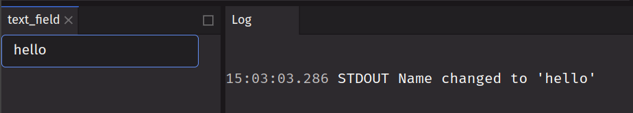

# [ui.text_field](../components/text_field.md)

A text field is a single-line text input field. It is used to collect a single line of text from the user.

## Log value when text field changes

```python
from deephaven import ui

text_field = ui.text_field(
    placeholder="Enter your name", on_change=lambda e: print(f"Name changed to '{e}'")
)
```



## Display text field value in UI

```python
@ui.component
def ui_input():
    text, set_text = ui.use_state("hello")

    return [ui.text_field(value=text, on_change=set_text), ui.text(f"You typed {text}")]


my_input = ui_input()
```


