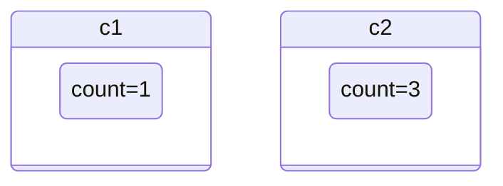
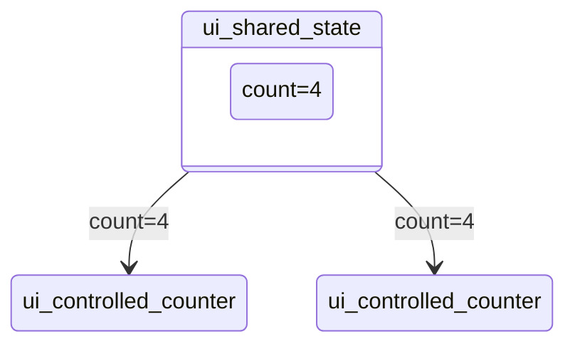

# Quick start

Get started by importing the `deephaven.ui` package as `ui`:

```python
from deephaven import ui
```

The `ui` package contains many *components*, which you can display in the UI:

```python
hello_world = ui.heading("Hello World!")
```


By assigning the component to the `hello_world` variable, it displays in the UI in a panel named `hello_world`.

## Handling events

Write functions to handle events. To write a button that will print event details to the console when clicked:

```python
my_button = ui.button("Click Me!", on_press=lambda e: print(f"Button was clicked! {e}"))
```


## Creating components

Use the `@ui.component` decorator to create your own custom components. This decorator wraps the function provided as a Deephaven component. For more details on the architecture, see [TODO: Link to architecture]().

We can display a heading above a button as our custom component:

```python
@ui.component
def ui_foo_bar():
    return [
        ui.heading("Click button below"),
        ui.button("Click Me!", on_press=lambda: print("Button was clicked!")),
    ]


foo_bar = ui_foo_bar()
```


## Using state

Often, you’ll want to react to the button presses and update the display. For example, to count the number of times a button has been pressed, use [`ui.use_state`]() to introduce a *state variable* in your custom component:

```python
@ui.component
def ui_counter():
    count, set_count = ui.use_state(0)
    # ...
```

Returned from `ui.use_state` is a tuple with two values: the current state (`count`), and a function to update that state (`set_count`).

The first time the button is displayed, the count will be `0` because that is the initial value passed into `ui.use_state`. Call `set_count` to update the state:

```python
@ui.component
def ui_counter():
    count, set_count = ui.use_state(0)
    return ui.button(f"Pressed {count} times", on_press=lambda: set_count(count + 1))
```

When state is updated, deephaven.ui will call your component again to re-render with the new value. After clicking once, it will re-render with `count` set to `1`, then set to `2`, and so on.

Each individual component has its own state:

```python
@ui.component
def ui_counter():
    count, set_count = ui.use_state(0)
    return ui.button(f"Pressed {count} times", on_press=lambda: set_count(count + 1))


c1 = ui_counter()
c2 = ui_counter()
```


> [!NOTE]
> Functions are prefixed with `use_` are called *hooks*. `use_state` is built-in to deephaven.ui, and there are other hooks built-in shown below. You can also create your own hooks.
> Hooks are special functions. They must only be used at the *top* of a `@ui.component` or another hook. If you want to use one in a conditional or a loop, extract that logic to a new component and put it there.

## Sharing state

In the previous example, the two buttons incremented their counter independently. State was stored within the counter components:



What if we wanted to have two buttons share the same count? To do this, move the state `count` upward to a parent component:



In the example below, we create a parent component `ui_shared_state` that contains the state, and then passes the state down into two `ui_controlled_counter` components. Now the buttons will always be in sync:

```python
@ui.component
def ui_controlled_counter(count, operation, on_press):
    return ui.button(f"Value is {count}, press to {operation}", on_press=on_press)


@ui.component
def ui_shared_state():
    count, set_count = ui.use_state(0)

    def handle_press():
        set_count(count + 1)

    return [
        ui.heading(f"Value is {count}"),
        ui_controlled_counter(count, "increment", lambda: set_count(count + 1)),
        ui_controlled_counter(count, "decrement", lambda: set_count(count - 1)),
    ]


shared_state = ui_shared_state()
```


